# BASH SCRIPTING
+ Bash is a powerful work environment and scripting language
+ Penetration Testers need to sharpen their bash scripting skills to automate many Linux commands

# 1 - INTRO TO BASH SCRIPTING
+ A bash script is a text file containing several Linux commands that can be executed in terminal
+ Let's write an example `Hello World` bash script

```bash
#!/bin/bash
# Hello World Bash Script
echo "Hello World!"
```

1. First line has characters `#!` called `shebang` and a binary file `/bin/bash`. This line tells that this file should be run with `/bin/bash` when executing
2. Second line starts with `#`. Every line starting with `#` is known as comment and is ignored by the interpreter
3. Third line is the command that is going to be executed which prints 'Hello World!' to the terminal

For execution we should do several things
1. Give execution permission with `chmod` command
2. Then execute it with `./filename` notation. `./` indicates the current path

```bash
# Give execution permission
chmod +x hello-world.sh
# chmod is a command to change file permission
# +x is for adding execution permission to a file

# Executing the bash script
./hello-world.sh
```

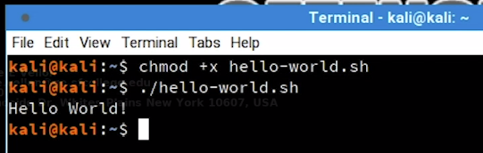

# 2 - VARIABLES
+ Variables are places to store data and use them later
+ We can declare variables in several ways
+ The simplest one is `name=value`

```bash
first_name=Good
last_name=Hacker
```

+ To reference and use a variable we preceed the variable with `$` character

```bash
echo $first_name $last_name
Good Hacker
```

+ It is better to give varialbes names in scripting way to make it easier to read
+ Bash interprets certain characters in specific ways
+ For example to put some space in our values we can not use them like this

```bash
greeting=Hello World
```

+ Bash will interpret whitespace so we can not use it in out value
+ To handle this we should put it in single quotes `''` or double quotes `""` like this
+ Bash interpret single quote `''` and double quote `""` differently
+ Every character inside single quotes `''` are viewed literaly or string
+ Every character inside single quotes `''` are viewed literaly or string except `$` ,`\`, \`
+ Let's see some examples for these stuff

1. Declare varialbe with single quotes

```bash
greeting='Hello World'
echo $greeting
Hello World
```

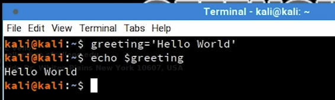

2. Declare variable with double quotes

```bash
greeting2="New $greeting"
echo $greeting2
New Hello World
```

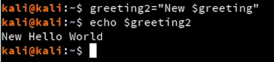

3. We can store a command's output into a a varialbe by putting the command in `$()`

```bash
user=$(whoami)
echo $user
kali
```

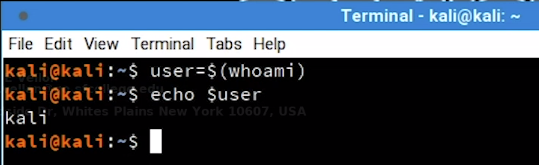

4. We can so example number 3 with backtick character \` however it is an older and deprecated method.

```bash
user=`whoami`
echo $user
kali
```

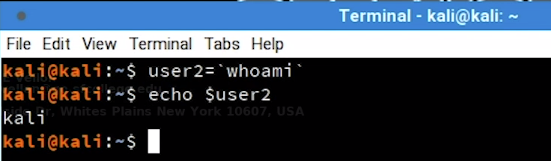

+ Examples number 3 and 4 are called command substitution and it is done in s sub-shell
+ Changing variables in the sub-shell will not alter variables in master process

5. Let's see this in example number 5

```bash
#!/bin/bash -x
# -x adds additional debug output when executing

var1=value1
echo $var1

var2=value2
echo $var2

$(var1=newvar1)
echo $var1

`var2=newvar2`
echo $var2
```

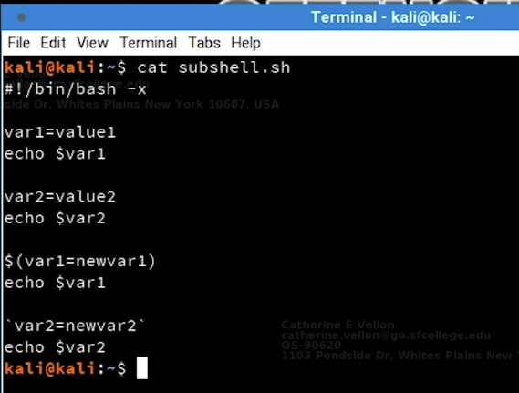

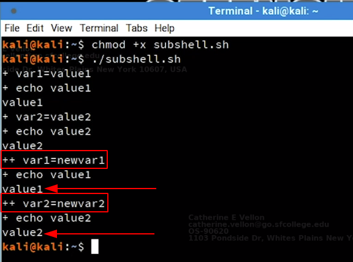

+ The command being executed in the sub-shell is recognized with `++` sign and the commands executed in current shell is recognized with `+` sign
+ As we can see variables `var1` and `var2`  are not changed as we said before.
+ Because second declaration of `var1` and `var2` is inside sub-shell and did not change the values in current shell.


## 2.1 - ARGUMENTS
+ We can use arguments in our bash script but it is not necessary
+ We may use arguments in commands we run everyday for example

```bash
ls -l /var/log
# both -l and /var/log are arguments to ls command
```

+ In this example we will write a simple bash script that accepts arguments

```bash
#!/bin/bash

echo "The first two arguments are $1 and $2"
# $1 and $2 refers to the first and second argument of the script
# $0 refer to the bash script file name itselft
```

+ Let's run the script and see the results

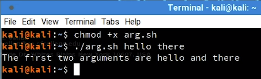

+ There are number of other special bash variables for example

```bash
$? # which show exit status of last process
$RANDOM # which generates a random number
```

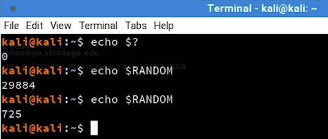

## 2.2 - READING USER INPUT
+ We can read user inputs while the script is running with `read` command
+ Here we have an example to read user input, assign it to `answer` variable and finally print it

```bash
#!/bin/bash

echo "Hello there, would you like to learn how to hack: Y/N?"

read answer

echo "Your answer was $answer"
```

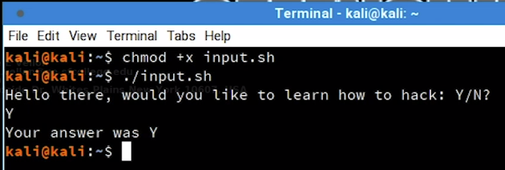

+ Let examine another example with additional arguments for `read` command

```bash
#!/bin/bash
# Prompt the user for credentials

read -p 'Username: ' username
read -sp 'Password: ' password
# -p is for prompt a text
# -s is for silent mode (not shows the characters)

echo "Thanks, your creds are as follows: " $username " and " $password
```

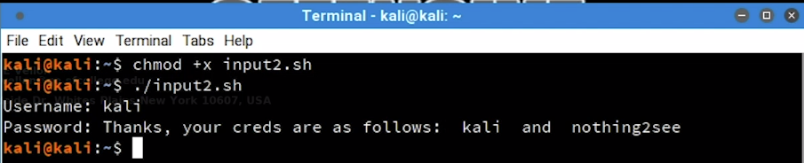

## 3 - IF, ELSE, ELIF STATEMENTS
+ Conditional statements allow us perform different actions based on different conditions
+ `IF` statement is relatively simple. Pay attention to the syntax specially the spaces between `[]`

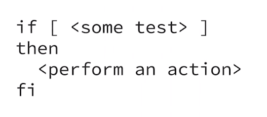

+ Let's take a look at an example
+ Here we will take an input as age from the user and if the age of the user is less than 16 it will print a warning message.

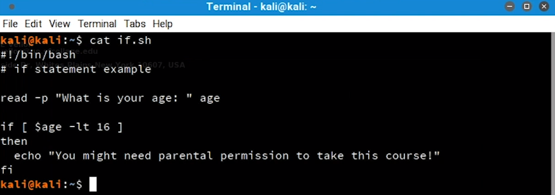

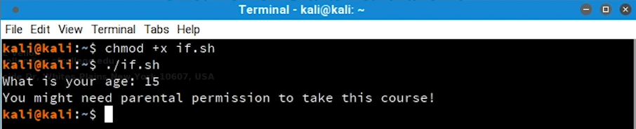

+ The statement between brackets `[]` are a `test` command
+ We can rewrite previous example with `test` command like below:

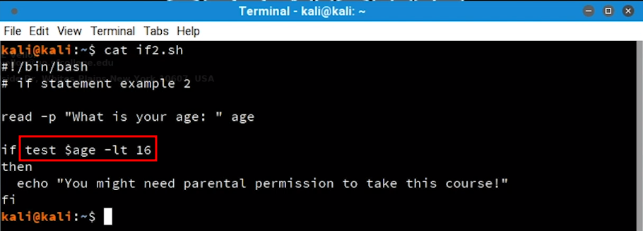

+ To perfrom differnt actions based on not metting the condition, we can use else statement
+ The basic syntax is like below

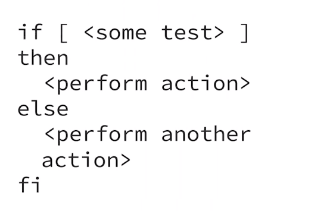

+ Let's see previous example with `else` statement to do another action in terms of being older than 16:

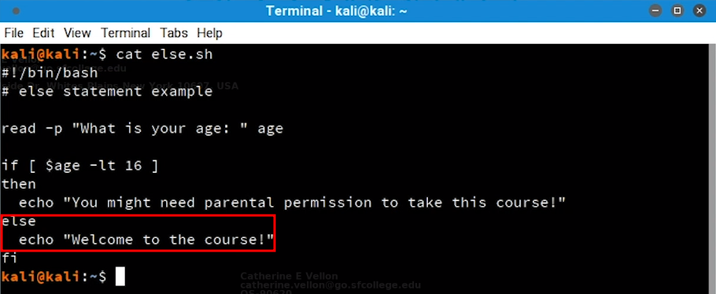

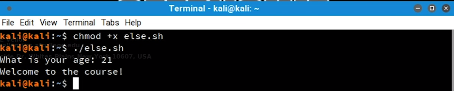

+ As we see the `if/else` statement allows to run just 2 code execution branches
+ We can use `elif` statement to run several code execution branches with different conditions, The basic syntax is as below:

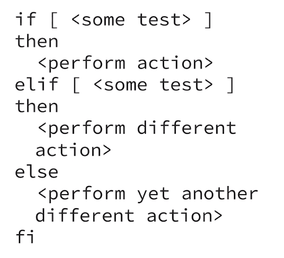

+ Let's extend our age example again to include `elif` statement

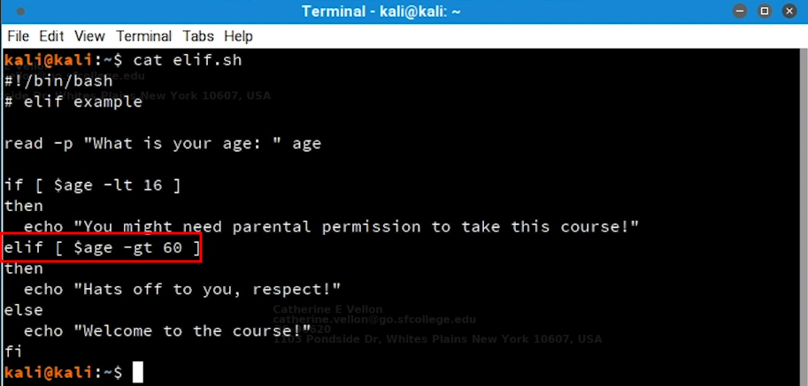

+ Let's run it to see the result

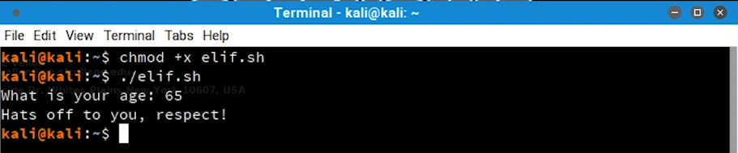