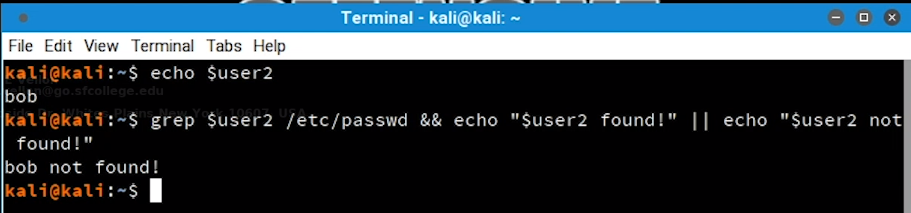

# BASH SCRIPTING
+ Bash is a powerful work environment and scripting language
+ Penetration Testers need to sharpen their bash scripting skills to automate many Linux commands

# 1 - INTRO TO BASH SCRIPTING
+ A bash script is a text file containing several Linux commands that can be executed in terminal
+ Let's write an example `Hello World` bash script

```bash
#!/bin/bash
# Hello World Bash Script
echo "Hello World!"
```

1. First line has characters `#!` called `shebang` and a binary file `/bin/bash`. This line tells that this file should be run with `/bin/bash` when executing
2. Second line starts with `#`. Every line starting with `#` is known as comment and is ignored by the interpreter
3. Third line is the command that is going to be executed which prints 'Hello World!' to the terminal

For execution we should do several things
1. Give execution permission with `chmod` command
2. Then execute it with `./filename` notation. `./` indicates the current path

```bash
# Give execution permission
chmod +x hello-world.sh
# chmod is a command to change file permission
# +x is for adding execution permission to a file

# Executing the bash script
./hello-world.sh
```


# 2 - VARIABLES
+ Variables are places to store data and use them later
+ We can declare variables in several ways
+ The simplest one is `name=value`

```bash
first_name=Good
last_name=Hacker
```

+ To reference and use a variable we preceed the variable with `$` character

```bash
echo $first_name $last_name
Good Hacker
```

+ It is better to give varialbes names in scripting way to make it easier to read
+ Bash interprets certain characters in specific ways
+ For example to put some space in our values we can not use them like this

```bash
greeting=Hello World
```

+ Bash will interpret whitespace so we can not use it in out value
+ To handle this we should put it in single quotes `''` or double quotes `""` like this
+ Bash interpret single quote `''` and double quote `""` differently
+ Every character inside single quotes `''` are viewed literaly or string
+ Every character inside single quotes `''` are viewed literaly or string except `$` ,`\`, \`
+ Let's see some examples for these stuff

1. Declare varialbe with single quotes

```bash
greeting='Hello World'
echo $greeting
Hello World
```


2. Declare variable with double quotes

```bash
greeting2="New $greeting"
echo $greeting2
New Hello World
```


3. We can store a command's output into a a varialbe by putting the command in `$()`

```bash
user=$(whoami)
echo $user
kali
```


4. We can so example number 3 with backtick character \` however it is an older and deprecated method.

```bash
user=`whoami`
echo $user
kali
```


+ Examples number 3 and 4 are called command substitution and it is done in s sub-shell
+ Changing variables in the sub-shell will not alter variables in master process

5. Let's see this in example number 5

```bash
#!/bin/bash -x
# -x adds additional debug output when executing

var1=value1
echo $var1

var2=value2
echo $var2

$(var1=newvar1)
echo $var1

`var2=newvar2`
echo $var2
```


+ The command being executed in the sub-shell is recognized with `++` sign and the commands executed in current shell is recognized with `+` sign
+ As we can see variables `var1` and `var2`  are not changed as we said before.
+ Because second declaration of `var1` and `var2` is inside sub-shell and did not change the values in current shell.


## 2.1 - ARGUMENTS
+ We can use arguments in our bash script but it is not necessary
+ We may use arguments in commands we run everyday for example

```bash
ls -l /var/log
# both -l and /var/log are arguments to ls command
```

+ In this example we will write a simple bash script that accepts arguments

```bash
#!/bin/bash

echo "The first two arguments are $1 and $2"
# $1 and $2 refers to the first and second argument of the script
# $0 refer to the bash script file name itselft
```

+ Let's run the script and see the results


+ There are number of other special bash variables for example

```bash
$? # which show exit status of last process
$RANDOM # which generates a random number
```


## 2.2 - READING USER INPUT
+ We can read user inputs while the script is running with `read` command
+ Here we have an example to read user input, assign it to `answer` variable and finally print it

```bash
#!/bin/bash

echo "Hello there, would you like to learn how to hack: Y/N?"

read answer

echo "Your answer was $answer"
```


+ Let examine another example with additional arguments for `read` command

```bash
#!/bin/bash
# Prompt the user for credentials

read -p 'Username: ' username
read -sp 'Password: ' password
# -p is for prompt a text
# -s is for silent mode (not shows the characters)

echo "Thanks, your creds are as follows: " $username " and " $password
```


# 3 - IF, ELSE, ELIF STATEMENTS
+ Conditional statements allow us perform different actions based on different conditions
+ `IF` statement is relatively simple. Pay attention to the syntax specially the spaces between `[]`


+ Let's take a look at an example
+ Here we will take an input as age from the user and if the age of the user is less than 16 it will print a warning message.


+ The statement between brackets `[]` are a `test` command
+ We can rewrite previous example with `test` command like below:


+ To perfrom differnt actions based on not metting the condition, we can use else statement
+ The basic syntax is like below


+ Let's see previous example with `else` statement to do another action in terms of being older than 16:


+ As we see the `if/else` statement allows to run just 2 code execution branches
+ We can use `elif` statement to run several code execution branches with different conditions, The basic syntax is as below:


+ Let's extend our age example again to include `elif` statement


+ Let's run it to see the result


# 4 - BOOLEAN LOGICAL OPERATIONS

+ Boolean operators may seem a bit mysterious `&` and `|`
+ We use these operators in command line when we want to pipe `|` commands

1. First of all the `&&` operator, we use it when we want to execute second command only if the first command executes successfully, Lets see it in an example


2. Let's see another example with a command that returns false when executing (Here grep returns false because user2 does not exist in `/etc/passwd`)


3. Let's see another example with or `||` operator, This operator is opposite of `&&` and it executes second command only if the first command fails. Here the first command failed to find user2 and instead the second command runs



4. We can use this in `test` commands or conditions to use multiple commands to meet a specific condition. Let's see an example that checks two conditions and runs a third command when both commands return true:


5. Let's see previous example with or `||` operator and use it in `if` statement, Here only one of them has to be true to meet the condition and enter the `if` branch


# 5 - LOOPS
+ In programming loops are used when we want to run a command several times until a specific condition is met
+ In bash two most predominant loops commands are `for` and `while`

## 5.1 - FOR LOOPS
+ This type of loop is used to perform given set of commands for each item in the loop
+ This loop grab items from list, execute command for each item and moves to the next item in the list and repeat the steps until the list is over


+ Lets look at an example
+ This one-liner bash command executes a `seq` command to generate numbers from 1 to 10
+ Then assign each number to `ip` variable
+ Then prints each ip address according to the numbes


+ We can rewrite this loop with Linux brace expansion
+ This syntax `{1..10}` is called sequence expression
+ We can use this for loop to generate range of IP addresses and run nmap for each of them


## 5.1 - WHLIE LOOPS
+ This type of loop executes a set of commands while an specific expression is true
+ It use `[]` for the test command


+ Let's rewrite previous example in while loop


+ First we initialize a variable named `counter` with value 1
+ Then we put a condition that until the counter is less than 10 print the IP address
+ and in each step we increment the counter variable by one until it reaches 10


+ This is not the output we expected and we don't have IP address `10.11.1.10` here
+ This is because of a common mistake named `off-by-one`
+ It is because we used `-lt` operator that means less than 10 and it does not reach 10 itself
+ We should use less than or equal operator `-le`
+ Let's fix this with a minor change


# 6 - FUNCTIONS
+ Functions are piece of code that can be used multiple times without rewriting it
+ There are blocks od code and sub-routine that can be called and executed whenever needed
+ There are two different formats for them, First one id familiar to bashs scripters and the second one is familiar to `C` programmers (They are same in terms of functionality)


+ Let's see an example for simple functions without arguments:


+ Here is another example for function with arguments
+ arguments are not declared in parentheses and they can be used with numbers (`$1...$n`) inside function
+ Function declaration should be before functions call


+ If we want to return value in traditional programming way we can't because bash won't let us to do so
+ We can just return a status code like 0 for success and non-zero for failure and we can access it with `$?`
+ If we want to return a custom value we can use a global variable and change its value inside function


+ If we use just return keyword inside function, the last status code would be rerurned instead

**Variables Scope**
+ scope of a variable means from where that variable is accessible
+ Global varialbes can be accessed from every part of the bash script
+ Local variables can just be accessed from where that varialbe is defined (It can be function or sub-shell)
+ If we want to define and use a local varialbe with same name as some global variable we can set value to it like this so we won't change global variables value

```bash
local name="Kourosh"
```
+ Let's see an example for local and global variables


+ We see that changing value of a local variable with same name as a global variable will not change the global variable's value
+ We also saw that changing the value of a global value inside function will affect its value in every part of bash script 